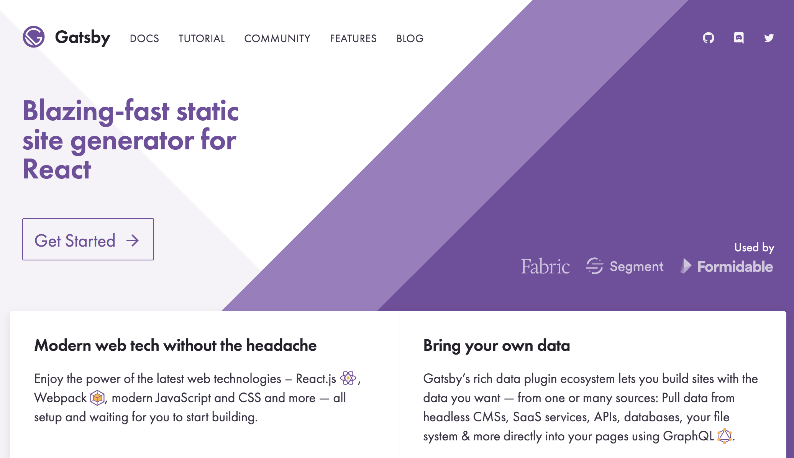

I remember the very first blog post I wrote. I was a little embarassed by it to be honest. I won't detail the whys and wherefores because 14 years is a lot of water under the bridge. I've used nearly every major blogging platform available in the last dozen years: Blogger, MovableType, WordPress, ExpressionEngine; you name it and I've tried it. I hate my technological schizphernia sometimes but at least it gives me an opportunity to try new things.

### Introducing: gatsby.js

I recently came across [Gatsby](https://www.gatsbyjs.org/). I was intrigued because it leverages ReactJS rather than a backend library to power a dynamic blog. I was just tired of dealing with servers and infrastructure and the expense and general hassle of a dynamic website for something as simple as what is essentially a static website. I really liked [MovableType](https://www.movabletype.org/) back in the day and while [Hugo](https://gohugo.io/) was interesting because it uses Go, I decided to give Gatsby a try and hone my React skills (which I'll need for some projects I'm currently working on).



### Installation and Setup

I managed to get up and running in a matter of minutes and that puts Gatsby above most other blogging platforms in my opinion. It really is as simple as just installing via `npm`, generating a site from a starter, and away you go. Other platforms promise on that front but always under-deliver.

#### 1) Install via npm:

```sh
$ npm install -g gatsby-cli
```

#### 2) Generate a new site from the starter I used:

```sh
$ gatsby new blog-mydomain.com git@github.com:greglobinski/gatsby-styled-blog-starter.git
```

#### 3) Start coding your site using [Visual Studio Code](https://code.visualstudio.com/):

```sh
$ code blog-mydomain.com
```

Now you have a basic gatsby site that includes all of the following components:

* `gatsby-plugin-catch-links`
* `gatsby-plugin-google-analytics`
* `gatsby-plugin-manifest`
* `gatsby-plugin-netlify`
* `gatsby-plugin-offline`
* `gatsby-plugin-react-helmet`
* `gatsby-plugin-sharp`
* `gatsby-plugin-styled-components`
* `gatsby-plugin-typography`
* `gatsby-remark-copy-linked-files`
* `gatsby-remark-images`
* `gatsby-remark-prismjs`
* `gatsby-remark-responsive-iframe`
* `gatsby-remark-smartypants`
* `gatsby-source-filesystem`
* `gatsby-transformer-remark`
* `gatsby-transformer-sharp`

### Customizing and Theming

This blog starter uses [`styled-components`](https://www.gatsbyjs.org/tutorial/part-two/#styled-components) to theme the elements in the site. As I've been learning React, I've found this method to be particularly powerful since it means you can inject references to a central theme object directly into your CSS and make global changes to your React components.

If you look in the file `src/components/TopBar/TopBar.jsx` you'll see a `Wrapper` component declared with references to the global theme properties sprinkled throughout the CSS. For example the height of the `TopBar` component is set like this:

```javascript
const Wrapper = styled.header`
  /* ... CSS properties */

  height: ${props => props.theme.topBar.sizes.height}px;

  /* ... more CSS properties */
`;
```

If you look in the file `src/styles/theme.js` you'll see a big object of all the settings referenced throughout the styling via the `props.theme` object.

```javascript
const theme = {
  ...
  topBar: {
    ...
    sizes: {
      height: 44 //pixels
    }
  },
  ...
};
```

Now you just need to fire up Adobe Color CC or another color theming tool and pick a good palette of colors to use for you site and update the `src/styles/colors.js` file to associate a paricular hex color value (`#FFFFFF` for white, for example) with a property key. Then in  your styling, you simply reference the property key rather than the hex value so when you change it in one place, it updates across the entire site. Very handy!

### Create Content

Content for the blog is primarily centered around Markdown files located in the `content/posts/**` directories. The convention is to name the directories for each entry with the date followed by a slug. From the starter you'll see some initial content to copy and paste in directories named `yyyy-mm-dd--slug-of-title`. If you were creating a new file on January 1st of 2018, you'd create a new `index.md` file in a directory called `2018-01-01--slug-of-title`. 

In the [front matter](https://jekyllrb.com/docs/frontmatter/) of the file, set properties like `title`, `subTitle`, `date` (expressed in [ISO 8601 UTC format](https://www.w3.org/TR/NOTE-datetime)), `path` (the path of the content used in the URL--usually just the "slug"), and an image to use as a `cover` photo.

> Note: This blog starter requires the use of a cover image by default. If you want to make the use of a cover image optional, you'll need to put some additional logic around the components that reference a `cover` property to check for its existence first otherwise you'll get errors trying to load the site without a `cover` property defined in the front matter.

The front matter of this blog post looks like this:

```
---
title: Blogging with Gatsby and React
subTitle: Creating a blogging pipeline using gatsby.js and react.js
date: "2017-12-21T22:00:00.000Z"
path: "/blogging-with-gatsby/"
cover: gatsbyjs.png
---
```

### Advanced Content

All of the components of the site are located in the `src/components` directory. Peruse them and see how logically they're laid out and how easy it is to make changes to suit your creative vision. The [Gatsby documentation](https://www.gatsbyjs.org/docs/) is well-written and shows several ways you can extend this basic set of functionality with even more involved processing. You can add new React components and integrate with different kinds of data using [GraphQL queries](https://www.gatsbyjs.org/tutorial/part-four/#how-gatsbys-data-layer-uses-graphql-to-pull-data-into-components). I'm anxious to see where this platform can take me!

#### References

* GatsbyJS: [https://www.gatsbyjs.org/](https://www.gatsbyjs.org/)
* ReactJS: [https://reactjs.org/](https://reactjs.org/)
* `styled-components` [https://github.com/styled-components/styled-components](https://github.com/styled-components/styled-components)